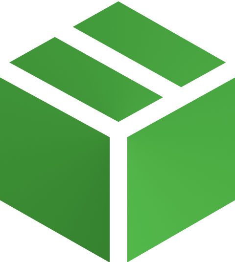

<div align="center">

  
  <h1>BikePack - Delivery-Service</h1>

  <p>
    Part of the S6 BikePack project.
  </p>


<!-- Badges -->
<p>
 
</p>

<h4>
    <a href="https://github.com/S6-BikePack">Home</a>
  <span> · </span>
    <a href="https://github.com/S6-BikePack/delivery-service#-about-the-project">Documentation</a>
  </h4>
</div>

<br />

<!-- Table of Contents -->
# 📓 Table of Contents

- [About the Project](#-about-the-project)
    * [Architecture](#-architecture)
    * [Tech Stack](#%EF%B8%8F-tech-stack)
    * [Environment Variables](#-environment-variables)
- [Getting Started](%EF%B8%8F-getting-started)
    * [Prerequisites](%EF%B8%8F-prerequisites)
    * [Running Tests](#-running-tests)
    * [Run Locally](#-run-locally)
    * [Deployment](#-deployment)
- [Usage](#-usage)
    * [Messages](#-messages)


<!-- About the Project -->
## ⭐ About the Project

The Delivery-Service is the service for the BikePack project that handles all deliveries in the system.
Using the system users can sign-up packages for delivery and riders can accept these deliveries.

<!-- Architecture -->
### 🏠 Architecture
For this service I have chosen a Hexagonal architecture. This keeps the service loosely coupled and thus flexible when having to change parts of the system.


<!-- TechStack -->
### 🛰️ Tech Stack
  #### Language
  <ul>
    <li><a href="https://go.dev/">GoLang</a></li>
</ul>

#### Dependencies
  <ul>
    <li><a href="https://github.com/gin-gonic/gin">Gin</a><span> - Web framework</span></li>
    <li><a href="https://github.com/gin-gonic/gin">Amqp091-go</a><span> - Go AMQP 0.9.1 client</span></li>
    <li><a href="https://github.com/swaggo/swag">Swag</a><span> - Swagger documentation</span></li>
    <li><a href="https://gorm.io/index.html">GORM</a><span> - ORM library</span></li>
  </ul>

#### Database
  <ul>
    <li><a href="https://www.postgresql.org/">PostgreSQL</a></li>
</ul>

<!-- Env Variables -->
### 🔑 Environment Variables

This service has the following environment variables that can be set:

`PORT` - Port the service runs on

`RABBITMQ` - RabbitMQ connection string

`Database` - Database connection string

<!-- Getting Started -->
## 	🛠️ Getting Started

<!-- Prerequisites -->
### ‼️ Prerequisites

Building the project requires Go 1.18.

This project requires a PostgreSQL compatible database with a database named `delivery` and a RabbitMQ server.
The easiest way to setup the project is to use the Docker-Compose file from the infrastructure repository.

<!-- Running Tests -->
### 🧪 Running Tests

-

<!-- Run Locally -->
### 🏃 Run Locally

Clone the project

```bash
  git clone https://github.com/S6-BikePack/delivery-service
```

Go to the project directory

```bash
  cd delivery-service
```

Run the project (Rest)

```bash
  go run cmd/rest/main.go
```


<!-- Deployment -->
### 🚀 Deployment

To build this project run (Rest)

```bash
  go build cmd/rest/main.go
```


<!-- Usage -->
## 👀 Usage

### REST
Once the service is running you can find its swagger documentation with all the endpoints at `/swagger` 

<!-- Messages -->
## 📨 Messages

### Publishing
The service publishes the following messages to the RabbitMQ server:

---
**delivery.create**

Published when a new delivery is created in the system.
Sends the newly created delivery in the  body.

```json
{
  "id": "string",
  "parcelId": "string",
  "riderId": "string",
  "pickupPoint": {
    "latitude": 0,
    "longitude": 0
  },
  "pickupTime": 0,
  "deliveryPoint": {
    "latitude": 0,
    "longitude": 0
  },
  "deliveryTime": 0,
  "status": 0
}
```


---
**delivery.update**

Published when a delivery is updated in the system.
Sends the updated delivery in the  body.

```json
{
  "id": "string",
  "parcelId": "string",
  "riderId": "string",
  "pickupPoint": {
    "latitude": 0,
    "longitude": 0
  },
  "pickupTime": 0,
  "deliveryPoint": {
    "latitude": 0,
    "longitude": 0
  },
  "deliveryTime": 0,
  "status": 0
}
```

---
**delivery.startDelivery**

Published when a delivery is started by a rider.
Sends the id of the delivery in the body.

```json
{
  "id": "string"
}
```

---
**delivery.completeDelivery**

Published when a delivery is completed by a rider.
Sends the id of the delivery in the body.

```json
{
  "id": "string"
}
```

### Subscribing
The service subscribes to the following messages to the RabbitMQ server:

---

<details>
  <summary><b>Rider-Service</b></summary>
  <ul>
    <li>rider.create</li>
    <li>rider.update</li>
  </ul>
</details>

---

<details>
  <summary><b>Customer-Service</b></summary>
  <ul>
    <li>customer.create</li>
    <li>customer.update.details</li>
  </ul>
</details>
